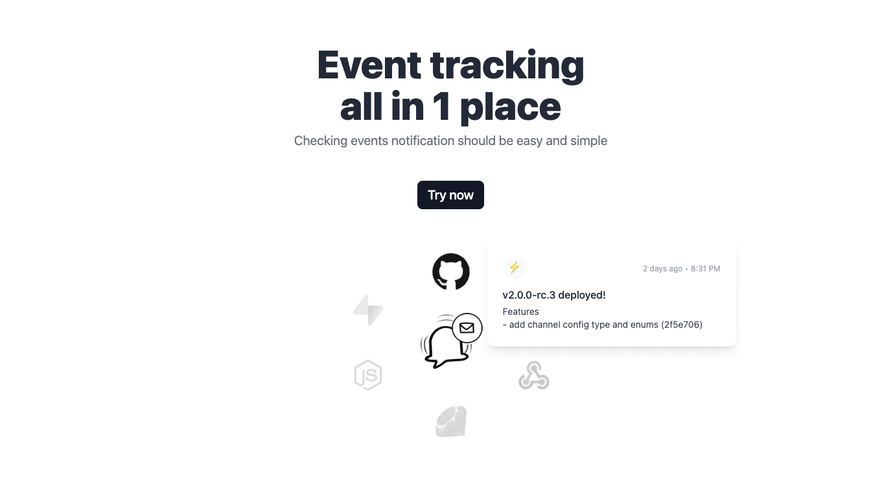

<!-- PROJECT LOGO -->
<br />
<p align="center">
  <a href="https://github.com/zernonia/simple-log">
    
  </a>

  <h3 align="center">SimpleLog</h3>

  <p align="center">
    Event tracking all in 1 place
    <br />
    Free • Open Source • API ready
    <br />
    <br />
    <a href="https://simple-log.vercel.app/">View Demo</a>
    ·
    <a href="https://github.com/zernonia/simple-log/issues">Report Bug</a>
    ·
    <a href="https://github.com/zernonia/simple-log/issues">Request Feature</a>
  </p>
</p>



## 🚀 Features

- 📋 Organize events neatly
- 🔗 Integration with other platform (Supabase etc)
- 🤩 Free & Open-Source
- 🚀 API ready

## 📇 About The Project

This project is inspired by one of Supabase's [tweet](https://twitter.com/supabase/status/1557919302426284032), where use listen to realtime changes and `sendSlackAlert` to save the events.

Actually, I'm doing the same for submission on [MadeWithSupabase](https://madewithsupabase.com) & [Aurora](http://aurora.courses/) too! But I save them in my own Discord Server.


But that quickly got out of hands, as all the events clumps in 1 channel, which makes organizing, tracking and eventually analyzing SUPER difficult.

Hence I built **SimpleLog**! It aims to be Open Source, so that anyone can contribute in creating SDK, or Integration they needed easily, while using SimpleLog.

Futhermore, this project allows me to spend some time looking into [Push Messaging](https://developer.mozilla.org/en-US/docs/Web/API/PushMessageData), which is curently missing in Supabase (as compare to [FCM](https://firebase.google.com/docs/cloud-messaging)). Thus, I've also created a custom push notification provider in this project!

This project is indeed a difficult one, but I had fun making it!

### 🔨 Built With

- [Supabase](https://supabase.com) - For Auth, DB, Realtime
- [Redis](https://redis.com/) - Caching API token
- [Nuxt 3](https://v3.nuxtjs.org/) - App & Server
- [Nuxt Content](https://content.nuxtjs.org/) - Docs
- [FormKit](https://formkit.com/) - Form Submission, Auto-animate
- [UnoCSS](https://github.com/unocss/unocss) - Tailwind styling, Icon

### ⚡ Supabase Service

- Supabase Database
- Supabase Auth (GitHub)
- Supabase Realtime
- Postgres Function

### Postgres SQL

1. Log event quickly!

   ```sql
   create or replace function
     log_event(input_owner_id uuid, input_project text, input_channel text, input_name text, input_description text, input_icon text, input_notify boolean, input_integration text) returns record
     language plpgsql
     as $$
       declare
         var_project_id uuid;
         var_channel_id uuid;
         return_record record;
       begin
         -- get project id and owner_id from projects table based on name
         select projects.id into var_project_id from projects where name = input_project and owner_id = input_owner_id;

         -- get channel id from channels table
         select id into var_channel_id from channels where name = input_channel and project_id = var_project_id;
         if var_channel_id is null then
           insert into channels (name, project_id) values (input_channel, var_project_id) returning id into var_channel_id;
         end if;

         insert into events (name, description, icon, notify, project_id, channel_id, owner_id, integration)
           values (input_name, input_description, input_icon, input_notify, var_project_id, var_channel_id, input_owner_id, input_integration )
           returning * into return_record;

         return return_record;
       end
     $$;
   ```

## 🌎 Local Development

### Prerequisites

Yarn

- ```sh
  npm install --global yarn
  ```

### Development

1. Clone the repo
   ```sh
   git clone https://github.com/zernonia/simple-log.git
   ```
2. Install NPM packages
   ```sh
   cd simple-log
   yarn install
   ```
3. Create `.env`
   ```
   SUPABASE_URL=
   SUPABASE_KEY=
   SUPABASE_SERVICE_KEY=
   REDIS_HOST=
   REDIS_PORT=
   REDIS_USERNAME=
   REDIS_PASSWORD=
   VAPID_PUBLIC_KEY=
   VAPID_PRIVATE_KEY=
   VAPID_SUBJECT=
   ```
4. Run local development instance
   ```sh
   yarn dev
   ```

## ➕ Contributing

Contributions are what make the open source community such an amazing place to be learn, inspire, and create. Any contributions you make are **greatly appreciated**.

1. Fork the Project
2. Create your Feature Branch (`git checkout -b feature/AmazingFeature`)
3. Commit your Changes (`git commit -m 'Add some AmazingFeature'`)
4. Push to the Branch (`git push origin feature/AmazingFeature`)
5. Open a Pull Request

## 📜 License

Distributed under the MIT License. See `LICENSE` for more information.

# 📧 Contact

Zernonia - [@zernonia](https://twitter.com/zernonia) - zernonia@gmail.com

Also, if you like my work, please buy me a coffee ☕😳

<a href="https://www.buymeacoffee.com/zernonia" target="_blank">
    
  </a>
